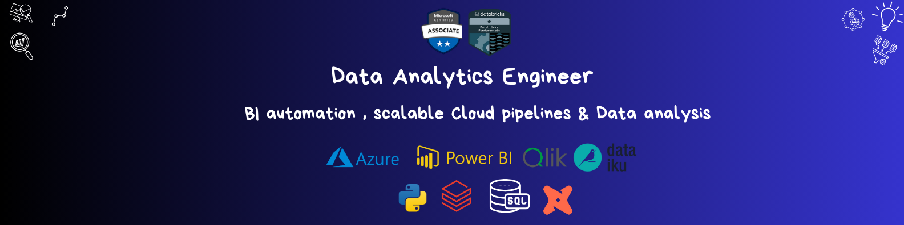

<h2 align="center">👋🏾 Hello, I'm Francis NOGO</h2>

Transforming data into <b>business value</b> through automation, analytics, and storytelling.

---

## 🧭 About Me  

I'm a **modern BI data analytics** *certified Microsoft and databricks*, passionate about transforming data into actionable insights.  
I combine **data engineering, BI design, and analytics storytelling** to empower marketing, sales, and product teams with reliable decision tools.  

Currently based in **Paris 🇫🇷**, I build **scalable data solutions** — from **ETL/ELT pipelines to dynamic dashboards** — with a balance of **technical precision** and **business acumen**.  

---

## ⚙️ Core Skills

### 🧠 Functional Expertise
> - Collect and formalise business requirements (user stories) to transform them into technical specifications    
> - Design, maintain and optimise BI solutions (medallion architecture): ETL/ELT pipelines, warehouses and Delta Lake tables, analytical dashboards.  
> - Ensure communication between technical and business teams to guarantee the operational use of data.

### 💻 Technical Stack
> - **Programming & Data:** Python, SQL (*Advanced*), DAX, M, R (*Advanced statistics*)
> - **Business Intelligence:** Power BI, Qlik Sense, Google analytics, Excel 
> - **Data Integration & API:** Postman, Power Automate, Azure Logic Apps, HubSpot
> - **Cloud & data Engineering:** Azure Data Factory, Delta lake, Databricks, DBT, Snowflake 
> - **Collaboration :** Git/GitHub, Confluence, Jira  

---

## 🌐 Certifications  

> 🏅 **Microsoft PL-300: Power BI Data Analyst**  
> 🏅 **Databricks fundamentals** & **Azure Databricks**  
> 🏅 **Data Analysis with Python** – freeCodeCamp  
> 🎯 **DBT analytics engineer** *(In progress)*  
---

## 🚀 Highlighted Projects  

###  **Bank Customer Churn Prediction (Azure databricks + DBT + Power BI)**  
> 🎯 **Goal:** Predict customer churn to optimize customer retention and lifetime value.  
> 🏆 **Impact:** End-to-end pipeline integrating data ingestion, transformation, and modeling — delivering actionable insights to marketing and product teams.  
> ⚙️ **Tech Stack:** Azure Databricks (*Auto Loader + Delta Lake + DLT*), DBT (*Gold Layer Modeling*), Python, Logic Apps (*Alerts*), Power BI .  

📈 *(Coming soon on GitHub)*

---

###  **Expense Analysis – ETL & Power BI Dashboard**  
> 🎯 **Goal:** Build a full ETL pipeline and financial dashboard with end-to-end data modeling.  
> 🏆 **Impact:** Automated data refresh & standardized reporting improving financial oversight.  
> ⚙️ **Tech Stack:** SQL Server, Power BI, Figma, Tabular Editor  

📊 [🔗 View Project on GitHub](https://github.com/GSDigger01/Expenses-Analysis-SQLServer)

---

###  **Amazon API - Stack Docker - ELK**  
> 🎯 **Goal:**Installation/configuration of ELK with Docker and automation of data retrieval on Amazon's API.  
> 🏆 **Impact:** Data storage, querying (No-SQL) and analysis for BI purposes.  
> ⚙️ **Tech Stack:** Python,Docker compose, ELK (Elasticsearch, Logstash), job scheduler

📊 [🔗 View Project on GitHub](https://github.com/GSDigger01/Stack-ELK-Docker)

---
###  **Retail Store & Customers Analysis with Power BI**  
> 🎯 **Goal:** Perform RFM segmentation to target high-value customers.  
> 🏆 **Impact:** Improved marketing efficiency via advanced Power BI visual storytelling.  
> ⚙️ **Tech Stack:** Python, Power BI Services, Figma, Tabular Editor  

📊 [🔗 View Project on GitHub](https://github.com/GSDigger01/Fashion-store-analysis)

---

###  **Customer Segmentation & RFM Analysis (Python)**  
> 🎯 **Goal:** Identify customer behavior patterns and loyalty segments using RFM metrics.  
> 🏆 **Impact:** Personalized retention strategies and improved campaign ROI.  
> ⚙️ **Tech Stack:** Python, Plotly, Jupyter Notebook  

📊 [🔗 View Project on GitHub](https://github.com/GSDigger01/RFM-Segmentation)

---

## 💼 Experience Snapshot  

#### **Bullart Business Academy** – *Data Training Consultant*  
🧩 Facilitated workshops to introduce entrepreneurs and professionals to key data concepts.  

#### **ONISEP** – *BI Data Analyst (Sales, Marketing, Advertising)*  
⚡ Migrated 90% of legacy reports to Qlik Cloud, automating KPIs and improving reporting agility.  

#### **SAINA-HITE** – *Data Analyst (Data Quality & R&D)*  
🧠 Built data pipelines with databricks to reducing anomalies by **35%** and boosting customer satisfaction.  

#### **Express Union Finance** – *BI Engineering Project*  
🏗️ Modeled a central Data Warehouse and automated ELT data flows for analytical purposes.  

---

## 📈 My Data Philosophy  

> “A true Data Analyst doesn’t just build dashboards — they master the **entire data value chain**,  
> from raw data to **business impact**.  
> My mission: bridge the gap between **data systems and strategic decisions**.”

---

## 📫 Let’s Connect  

  
  

---

⭐ *If you like my work, consider giving a star to my repositories — it really helps!*  

---
