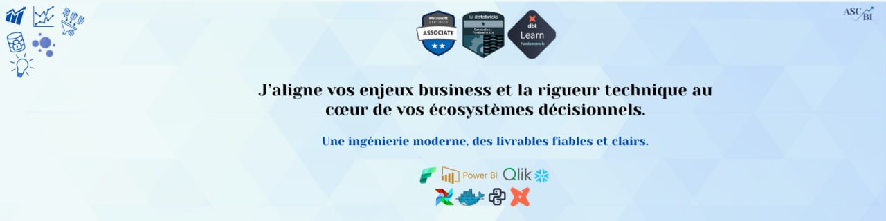

<h2 align="center">👋🏾 Hello, I'm Francis NOGO</h2>

Building <b>robust, scalable, and governed data pipelines</b> to transform trusted data into <b>business value</b>.

---

## 🧭 About Me  

> I'm a **Data & Analytics Engineer** *certified Microsoft, Databricks and dbt* passionate about building high-quality data foundations that drive actionable insights.  
I combine **data engineering, BI design, and data governance principles** to empower marketing, sales, and product teams with reliable decision tools.  

> Currently based in **Paris 🇫🇷**, I build **scalable data solutions** — from **ETL/ELT pipelines to dynamic dashboards** — ensuring **Data Quality** at every step to balance **technical precision** with **business strategy**.  

---

## ⚙️ Core Skills

### 🧠 Functional Expertise

> - **Implement Data Quality frameworks and advocate for Data Governance best practices** to ensure data reliability, trust, and compliance.  
> - Design, and optimize BI solutions (Medallion architecture): data warehouses, Delta Lake tables, and analytical dashboards.  
> - Ensure seamless communication between technical and business teams to guarantee the operational use of data.  

### 💻 Technical Stack
> - **Programming & Data:** Python, SQL (*Advanced*), DAX, M, R (*Advanced statistics*)
> - **Business Intelligence:** Power BI, Qlik Sense/Cloud, Google Analytics, Excel 
> - **Data Integration & API:** Postman, Power Automate, Azure Logic Apps, HubSpot
> - **Cloud & Data Engineering:** Azure Data Factory, dbt, SSIS, Snowflake 
> - **Collaboration:** Git/GitHub, Confluence, Jira 

---

## 🌐 Certifications  

> 🏅 **Microsoft PL-300: Power BI Data Analyst**  
> 🏅 **Databricks fundamentals** & **Azure Databricks**  
> 🏅 **Data Analysis with Python** – freeCodeCamp  
> 🏅 **DBT Fundamentals**     
---

## 🚀 Highlighted Projects  

###  **PME Data Quality Pipeline (Airflow + dbt Core + PostgreSQL + Slack)**  
> 🎯 **Goal:** Build a production-ready data quality pipeline for a fictitious B2B office supplies SME — automating ingestion, transformation, and business-rule validation across a full star schema.   
> 🏆 **Impact:** End-to-end pipeline delivering clean, tested analytics-ready data — with automated Slack alerts on failures, dbt lineage documentation, and KPI views directly consumable by Power BI.    
> ⚙️ **Tech Stack:** Apache Airflow 2.9 (DAG orchestration + LocalExecutor), dbt Core , PostgreSQL 15, Python, Docker, Power BI , Slack .    

📈 *(Coming soon on GitHub)*

---

###  **Expense Analysis (SQL server with stored prodedures + Power BI Dashboard**  
> 🎯 **Goal:** Build a full ETL pipeline (layer architecture) and financial dashboard with end-to-end data modeling from scratch.  
> 🏆 **Impact:** Automated data refresh & standardized reporting improving financial oversight.  
> ⚙️ **Tech Stack:** SQL Server, Power BI, Figma, Tabular Editor  

📊 [🔗 View Project on GitHub](https://github.com/GSDigger01/Expenses-Analysis-SQLServer)

---

###  **Amazon API - Stack Docker - ELK**  
> 🎯 **Goal:**Installation/configuration of ELK with Docker and automation of data retrieval on Amazon's API.  
> 🏆 **Impact:** Data storage, querying (No-SQL) and analysis for BI purposes.  
> ⚙️ **Tech Stack:** Python,Docker compose, ELK (Elasticsearch, Logstash), job scheduler

📊 [🔗 View Project on GitHub](https://github.com/GSDigger01/Stack-ELK-Docker)

---
###  **Retail Store & Customers Analysis with Power BI**  
> 🎯 **Goal:** Perform RFM segmentation to target high-value customers.  
> 🏆 **Impact:** Improved marketing efficiency via advanced Power BI visual storytelling.  
> ⚙️ **Tech Stack:** Python, Power BI Services, Figma, Tabular Editor  

📊 [🔗 View Project on GitHub](https://github.com/GSDigger01/Fashion-store-analysis)

---

###  **Customer Segmentation & RFM Analysis (Python)**  
> 🎯 **Goal:** Identify customer behavior patterns and loyalty segments using RFM metrics.  
> 🏆 **Impact:** Personalized retention strategies and improved campaign ROI.  
> ⚙️ **Tech Stack:** Python, Plotly, Jupyter Notebook  

📊 [🔗 View Project on GitHub](https://github.com/GSDigger01/RFM-Segmentation)

---

## 💼 Experience Snapshot  

#### **ASC-BI** – *Analytics Engineer*    
>🧩 Management and reliability improvement of Product and Marketing data marts, as well as analytical pipelines (Snowflake/dbt/Power BI).  

#### **Bullart Business Academy** – *Data Training Consultant*  
>🧩 Facilitated workshops to introduce entrepreneurs and professionals to key data concepts.  

#### **ONISEP** – *BI Data Analyst (Sales, Marketing, Advertising)*  
>⚡ Migrated 90% of legacy reports to Qlik Cloud, automating KPIs and improving reporting agility.  

#### **SAINA-HITE** – *Data Analyst (Data Quality & R&D)*  
>🧠 Built data pipelines with databricks to reducing anomalies by **35%** and boosting customer satisfaction.  

#### **Express Union Finance** – *BI Engineering Project*  
>🏗️ Modeled a central Data Warehouse and automated ELT data flows for analytical purposes.  

---

## 📈 My Data Philosophy  

> “A true Data Analyst doesn’t just build dashboards — they master the **entire data value chain**,  
> from raw data to **business impact**.  
> My mission: bridge the gap between **data systems and strategic decisions**.”

---

## 📫 Let’s Connect  

  
  

---

⭐ *If you like my work, consider giving a star to my repositories — it really helps!*  

---
